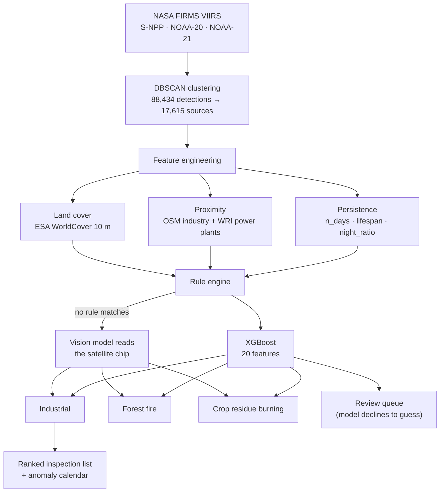

<div align="center">

# Fire or Factory?

**Context-aware classification of satellite thermal anomalies**

Smart India Hackathon 2026 · Problem Statement **SIH 26162**

[](https://www.python.org/)
[](https://fastapi.tiangolo.com/)
[](https://react.dev/)
[](https://xgboost.readthedocs.io/)
[](#data-sources)

A satellite reports **temperature, not cause**. This system reads a year of VIIRS
thermal detections over five Indian regions and separates industrial heat from
forest fires and crop-residue burning — using temporal persistence, night-time
behaviour, land context, and, where the rules fall silent, the satellite image itself.

**88,434 detections → 238 industrial sites to inspect (99.73% reduction)**

</div>

---

## 1. The problem

A refinery flare, a burning forest and a burning paddy field produce the *same kind
of record* in NASA FIRMS: a latitude, a longitude, a brightness temperature, a time.
Nothing in that record says what was burning.

That gap is operational, not academic. A State Pollution Control Board cannot act on
88,434 anonymous hot pixels. It can act on a ranked list of industrial sites that
burned persistently, at night, next to a known plant — and on the days those sites
ran hotter than their own normal.

## 2. What the system produces

| Output | Value | Meaning |
|---|---:|---|
| Thermal detections ingested | **88,434** | 3 VIIRS satellites, calendar year 2025, 5 regions |
| Distinct thermal sources | **17,615** | after DBSCAN spatial clustering |
| Classified as industrial | **238** | the operational inspection list |
| Volume reduction | **99.73%** | from raw pixels to actionable sites |
| Forest fire / crop burning | 5,165 / 11,981 | separated, not discarded |
| Held back for human review | **231** | the model is not allowed to guess here |
| Recovered by the vision layer | **868** | sources no rule could label |
| Anomaly days flagged | **999** across 202 sites | a site ≥3× hotter than its own baseline (peak **63.7×**) |

Every number above is read live from the pipeline outputs committed in this repo —
`outputs/metrics.json`, `outputs/nasa_metrics.json`, `data/processed/predictions.gpkg`.

## 3. The core insight

Persistence and night-time behaviour separate the three classes almost by themselves,
because the underlying human activity differs:

```text
Jindal Steel Works, Korba   3,968 detections · 288 active days over 364 · 79% at night  → INDUSTRIAL
Kumaon hillside              258 detections ·  13 active days over  39 · seasonal burst → FOREST_FIRE
Ludhiana paddy field           1 detection  ·   1 day · daytime                         → AGRI_BURN
```

**Persistence** separates a plant from an event: a factory burns all year, a forest
burns for a fortnight, a field burns for one afternoon. **Night ratio** then separates
the two that persist — crop burning averages 3% night-time activity across 11,981
sources, because nobody burns stubble at 2 a.m. Neither signal exists in a single
detection; both require a year of history, which is why the pipeline clusters first
and classifies second.

## 4. Architecture



**Four layers, in order of confidence:**

1. **Rules** — transparent, auditable thresholds on distance, persistence and land cover. Label 94% of sources in about a second.
2. **XGBoost** — learns the boundary the rules approximate, and supplies SHAP attributions per feature.
3. **Vision-language model** — where no rule matches, a satellite image chip is sent to Gemini Flash-Lite and it reports what is physically on the ground.
4. **Review queue** — whatever survives all three is handed to a human, deliberately unlabelled.

## 5. Validation

We report what was measured, including where the system is weak.

| Test | Result | What it proves |
|---|---:|---|
| Random 5-fold CV (macro-F1) | **0.917** | the model fits |
| **Region hold-out** (macro-F1) | **0.914** | it transfers to a region it has never seen — trained on four, tested on the fifth |
| 159 human-labelled gold sources (accuracy) | **86.8%** | performance against ground truth, not against our own rules |
| Vision layer vs. gold labels | **81.0%** vs **76.2%** for rules | the image beats the numbers on hard cases (42 of 45 answered) |
| Vision layer where rules are silent | **100%** (2/2 answered) | it answers where nothing else can |
| Independent NASA-label model | **89.5%** accuracy, AUC **0.694** | an entirely separate model, trained only on FIRMS-native fields |

**Why the NASA cross-check exists.** Our rules use OSM proximity, so a model trained on
rule labels and evaluated on rule labels proves nothing — it is circular. So a second
model (`src/step7_nasa_model.py`) was trained on NASA's own `type=static` flag using
*only* raw FIRMS columns (FRP, brightness, scan geometry, day/night), with no map
feature at all. It agrees with human labels 89.5% of the time (133 gold sources; AUC 0.694). Its own region hold-out
mean F1 is a weak **0.416** — because two of five regions contain almost no static
detections to learn from. We report that number rather than hide it.

**Ablation — the map features are doing the work.** Region hold-out macro-F1:

| Features | Macro-F1 |
|---|---:|
| All 23 features | **0.909** |
| Without land cover | 0.526 |
| Without land cover + distance | 0.336 |
| FIRMS only (no geospatial context) | 0.337 |

Top SHAP contributors: `dist_to_industry_m` (2.60), `lc_forest` (1.72), `lc_cropland` (0.80).

### Known limitations

- **The model is not permitted to answer on ambiguous sources.** Measured on them it was only 39% accurate — a coin-toss over three classes. Those 231 sources go to the review queue instead of receiving a confident wrong label.
- **Gold set is 159 sources**, hand-labelled from imagery. Small, and honest about it.
- **Five regions, one calendar year.** Chosen to cover the three classes (Jamnagar refineries, Kumaon forest, Ludhiana cropland) plus India's two largest thermal clusters by capacity (Korba 24 GW, Singrauli 21 GW, per WRI).
- **`industry_name` is the *nearest* facility**, which can be 45 km away; the UI only shows a site name within 2 km, so a forest fire is never mislabelled with a power plant's name.

## 6. Interfaces

Two dashboards read the same committed outputs and are guaranteed to agree —
the REVIEW-queue logic and the site-naming distance rule are defined identically in both.

| | React + FastAPI | Streamlit |
|---|---|---|
| Purpose | evaluation / demo | fast internal checks |
| Map | Leaflet, theme-aware Esri basemaps | Folium |
| Theme | light + dark | light |
| Data path | FastAPI JSON endpoints | direct GeoPackage reads |

Both open on a **Raw satellite data ⇄ After classification** switch — the raw view
serves identical grey markers with the class columns stripped from the API response,
so "the feed carries no cause" is demonstrated rather than asserted.

Tabs: **Map** · **Inspection priorities** (ranked by anomaly behaviour, not by model
confidence — confidence is 1.00 on 99% of sources and therefore useless for ranking) ·
**Anomalies** · **Validation** · **Method**.

## 7. Quickstart

The processed outputs and trained models are committed, so **both dashboards run
without an API key and without re-running the pipeline.**

```bash
git clone <repo-url> && cd SIH
python3 -m venv venv && source venv/bin/activate
pip install -r requirements.lock.txt
```

**React + FastAPI (recommended):**

```bash
cd web && npm install && npm run build && cd ..
uvicorn api.main:app --port 8000
# → http://127.0.0.1:8000     API docs at /docs
```

**Streamlit:**

```bash
python verify.py          # integrity checks over the outputs — run before any demo
streamlit run app.py
```

### Rebuilding from source data

```bash
cp .env.example .env      # add FIRMS_MAP_KEY (free: firms.modaps.eosdis.nasa.gov/api/)
python run_all.py         # full pipeline; --force to rebuild everything
```

The vision layer is optional. Add a free `GEMINI_API_KEY` from
[aistudio.google.com/apikey](https://aistudio.google.com/apikey) to enable it; without
it the pipeline still completes end to end, the review queue is simply larger.

```bash
python src/step4d_gemini.py --validate   # measure it against the gold labels first
python src/step4d_gemini.py              # then run it on the review queue
python src/step4e_merge_vlm.py           # fold the answers back into the labels
```

## 8. Repository layout

```text
src/          pipeline, one numbered step per stage (step1 → step7)
api/          FastAPI service — JSON only, no computation
web/          React + Vite + Leaflet dashboard
app.py        Streamlit dashboard
run_all.py    runs the whole pipeline in dependency order
verify.py     integrity checks over the produced artefacts
data/         raw inputs and processed GeoPackages (processed data committed)
models/       trained XGBoost models
outputs/      metrics, figures, QGIS styles, gold-label sheets
docs/         phase reports and design notes
```

## 9. Data sources

| Dataset | Provider | Use | Licence |
|---|---|---|---|
| VIIRS 375 m active fire | NASA FIRMS (S-NPP, NOAA-20, NOAA-21) | thermal detections | Open, NASA EOSDIS |
| Industrial & mining polygons | OpenStreetMap (Geofabrik extracts) | proximity to industry | ODbL |
| Global Power Plant Database | WRI | 388 Indian thermal plants | CC BY 4.0 |
| WorldCover 10 m | ESA | land cover class | CC BY 4.0 |

All inputs are openly licensed; no proprietary or restricted data is used.

## 10. Documentation

| Document | Contents |
|---|---|
| [Datasets explained](PPTSTUFF/DATASETS.md) | every field, where it comes from, why it is trusted |
| [Phase 1 report](docs/PHASE1_REPORT.md) | ingestion and geospatial context |
| [Phase 2 report](docs/PHASE2_REPORT.md) | clustering and persistence features |
| [Phase 3 report](docs/PHASE3_REPORT.md) | labelling, rules, gold set |
| [Vision layer](docs/VLM_LAYER.md) | how the image is read where rules go silent |
| [Data audit log](docs/DATA_AUDIT.md) | every correction made to the data, dated |
| [Web dashboard](web/README.md) | dev/build instructions for the React app |

---

<div align="center">
<sub>Smart India Hackathon 2026 · SIH 26162 · built on open data, reproducible end to end</sub>
</div>
