# Full Workflow — For the Presentation

The project in one line: filter the **millions of hot points** (fire
detections) coming from satellites and say whether each one is **a
factory's flare, a forest fire, or crop residue being burned in a
field** — without any human manually looking at it.

---

## 1. Full Pipeline — Diagram

```mermaid
flowchart TD
    A["STEP 1 — FIRMS Download\nHot points from NASA satellites\n(3 satellites, several months of data)"] --> B

    B["STEP 2 — Extract Context\nFrom OpenStreetMap: where's the factory?\nwhere's the forest/farmland/city?"] --> B2
    B2["STEP 2b — Power Plants\nAdd WRI's verified database\n(coal/gas separated from solar/wind)"] --> B3
    B3["STEP 2 again — Distance\nremeasure with the new plants included"] --> C
    C["STEP 2c — Landcover\nESA WorldCover satellite imagery\n(OSM was incomplete, this fills it in)"] --> D

    D["STEP 3 — Persistence\n(THE HEART OF THE PROJECT)\nMerge points that repeatedly show up\nat the same place into ONE 'source'"] --> E

    E["STEP 4 — Rule-Based Labels\nSimple conditions:\nnear a factory + repeats = INDUSTRIAL\non forest + far + many days = FOREST_FIRE\non farmland + 1-2 days = AGRI_BURN"] --> F

    F["STEP 4d/4e — AI Photo Check (optional)\nWhere rules are confused,\nshow the satellite photo to AI (Gemini)"] --> G

    G["GOLD LABELS\nA human hand-labels 159 sources\nby looking at the satellite photo\n(Streamlit app)"] --> H

    H["STEP 5 — Model Training\nAn XGBoost model is trained\nGold labels kept SEPARATE from training\n(so the test stays honest)"] --> I

    I["EVALUATION — 3 ways\n(a) random split — easy\n(b) region hold-out — harder\n(c) GOLD LABELS — most honest"] --> J

    J["Dashboard\nstreamlit run app.py\nMap + charts + a confidence\nscore for every source"]

    style D fill:#ffd54f,stroke:#333,stroke-width:2px
    style G fill:#81c784,stroke:#333,stroke-width:2px
    style I fill:#64b5f6,stroke:#333,stroke-width:2px
```



---

## 2. What Each Step Does

### STEP 1 — Data Download
Download satellite hotspots from NASA FIRMS — wherever heat (fire
radiative power) was detected, that point is captured. This is raw
data; at this stage nothing is known about what's actually producing
the heat.

### STEP 2 — Context (what's nearby?)
For each hotspot, check OpenStreetMap for what's around it: is there a
factory? Forest? Farmland? Distance is measured too — how far is the
nearest factory.

### STEP 2b — Real Power Plants
OSM is incomplete. WRI's (World Resources Institute) verified database
is added — 1,589 Indian power plants, and it also tells us **which are
coal/gas and which are solar/wind** (solar/wind don't produce heat, so
calling them a "factory" would be wrong).

### STEP 2c — Real Landcover
People on OSM map roads, not fields and forests — so 82% of sources
had land-type "unknown". ESA WorldCover (a satellite-built map, global,
every 10×10 metres) fills that gap.

### STEP 3 — Persistence (THE HEART OF THE PROJECT)
A single refinery flare might be detected 198 times — that isn't 198
separate events, it's ONE thing that kept showing up. This step merges
all of those into ONE "source" and reports: how many days it showed
up, how regular it was, whether it appeared at night or during the
day.

### STEP 4 — Rule-Based Labelling
Simple conditions (no AI, a clear formula):
- **INDUSTRIAL** — within 1 km of a factory + not a one-off (repeats)
- **FOREST_FIRE** — on forest + far from a factory + ran for several days
- **AGRI_BURN** — on farmland + 1-2 days + daytime
- **UNSURE** — where nothing can be said with confidence

### STEP 4d/4e — AI Photo Check (optional)
Where the rules are also confused, the satellite photo is shown to
Gemini AI and its answer is merged into the labels too.

### GOLD LABELS — The Human's Job
This is the single most important step. **159 sources** were
hand-labelled by looking at the satellite photo and cross-checking
against Google Maps — because every other label was produced by
"rules", and testing the model only against those would just be a
false score of "it memorized its own rules". The model has NEVER seen
the gold labels — so the score on them is the real one.

### STEP 5 — Model Training
An XGBoost model is trained on the rule-labelled data. Gold labels are
kept **completely separate** from training (to avoid leakage) — so the
test stays honest.

### Evaluation — 3 Ways, Each Stricter
| Test | What it does | Score (macro-F1) |
|---|---|---|
| (a) Random 5-fold | Split rows randomly — the easiest | 0.962 |
| (b) Region hold-out | Remove an entire region — test on a new one | 0.954 |
| (c) **Gold labels** | 159 human labels — **most honest** | **0.76*** |

*\*on the 3 real classes only (INDUSTRIAL/FOREST_FIRE/AGRI_BURN); with
UNCLEAR included it's 0.57 (UNCLEAR isn't even one of the model's
classes, so that number is extra conservative).*

**Final Gold Accuracy: 87.4%**

### Dashboard
`streamlit run app.py` — a map of all sources, their confidence score,
an FRP chart, and which INDUSTRIAL sites should be manually inspected.

---

## 3. Numbers — At a Glance

```
88,434  raw FIRMS detections
   ↓  (STEP 3 — clustering)
17,615  unique sources
   ↓  (STEP 4/5 — rules + model)
12,113  AGRI_BURN
 5,162  FOREST_FIRE
   340  INDUSTRIAL

99.78% reduction — from raw satellite noise to actionable sources
```

**Model Performance (on 159 gold labels):**
- Accuracy: **87.4%**
- Macro-F1 (3 classes): **0.76**
- AGRI_BURN: precision 0.87, recall 0.99
- FOREST_FIRE: precision 0.92, recall 0.63
- INDUSTRIAL: precision 0.82, recall 0.47

**Honesty check (Ablation):** removing the rule-based features
(land-cover, factory distance) drops the score from 0.952 to 0.357 —
proof that the model isn't just copying the rules but is genuinely
learning something of its own.
