# Poora Workflow — Presentation ke liye

Ek line mein project: satellite se aane wale **lakhon garam points** (fire
detections) ko chhaan kar bata dena ki wo **factory ka flare hai, jungle ki
aag hai, ya khet mein parali jalayi ja rahi hai** — bina kisi insaan ke
manually dekhe.

---

## 1. Poora Pipeline — Diagram

```mermaid
flowchart TD
    A["STEP 1 — FIRMS Download\nNASA satellite se garam points\n(3 satellites, kai mahine ka data)"] --> B

    B["STEP 2 — Context Nikalna\nOpenStreetMap se: factory kahan hai?\njungle/khet/shehar kahan hai?"] --> B2
    B2["STEP 2b — Power Plants\nWRI ka verified database jodo\n(coal/gas alag, solar/wind alag)"] --> B3
    B3["STEP 2 dobara — Distance\nnaye plants ke saath fir se naapo"] --> C
    C["STEP 2c — Landcover\nESA WorldCover satellite tasveer\n(OSM adhoora tha, ye poora hai)"] --> D

    D["STEP 3 — Persistence\n(PROJECT KA DIL)\nEk hi jagah baar-baar dikhne wale\npoints ko jodkar EK 'source' banao"] --> E

    E["STEP 4 — Rule-Based Labels\nSeedhi shartein:\nfactory ke paas + baar-baar = INDUSTRIAL\njungle pe + door + kai din = FOREST_FIRE\nkhet pe + 1-2 din = AGRI_BURN"] --> F

    F["STEP 4d/4e — AI Photo Check (optional)\nJahan rules confuse hain,\nsatellite photo AI (Gemini) ko dikhao"] --> G

    G["GOLD LABELS\nInsaan khud 159 sources\nsatellite photo dekh kar\nhaath se label karta hai\n(Streamlit app)"] --> H

    H["STEP 5 — Model Training\nXGBoost model train hota hai\nGold labels training se ALAG rakhe\n(taaki test imaandar rahe)"] --> I

    I["EVALUATION — 3 tarah se\n(a) random split — aasan\n(b) region hold-out — kada\n(c) GOLD LABELS — sabse imaandar"] --> J

    J["Dashboard\nstreamlit run app.py\nMap + charts + har source ka\nconfidence score"]

    style D fill:#ffd54f,stroke:#333,stroke-width:2px
    style G fill:#81c784,stroke:#333,stroke-width:2px
    style I fill:#64b5f6,stroke:#333,stroke-width:2px
```



---

## 2. Har Step Kya Karta Hai (Hinglish)

### STEP 1 — Data Download
NASA FIRMS se satellite hotspots download karte hain — jahan bhi kahin garmi
(fire radiative power) detect hui, wo point mil jata hai. Ye raw data hai,
abhi kuch pata nahi kis cheez ki garmi hai.

### STEP 2 — Context (aas-paas kya hai?)
Har hotspot ke aas-paas OpenStreetMap se pata karte hain: factory hai kya?
Jungle hai kya? Khet hai kya? Distance bhi naapte hain — sabse paas ki
factory kitni door hai.

### STEP 2b — Asli Power Plants
OSM adhoora hota hai. WRI (World Resources Institute) ka verified database
jodte hain — 1,589 Indian power plants, aur ye bhi pata hai ki **kaunsa
coal/gas hai aur kaunsa solar/wind** (solar-wind garmi nahi dete, unhe
"factory" maanna galat hoga).

### STEP 2c — Asli Landcover
OSM pe log sadkein map karte hain, khet-jungle nahi — isliye 82% sources ka
land-type "unknown" tha. ESA WorldCover (satellite se bani tasveer, poori
duniya, har 10x10 metre) se ye gap bhara.

### STEP 3 — Persistence (PROJECT KA DIL)
Ek refinery ka flare 198 baar detect ho sakta hai — wo 198 alag ghatnayein
nahi hain, EK cheez hai jo baar-baar dikhi. Ye step un sab ko jod kar EK
"source" banata hai, aur batata hai: kitne din tak dikha, kitna regular tha,
raat ko dikha ya din mein.

### STEP 4 — Rule-Based Labelling
Seedhi shartein (koi AI nahi, saaf formula):
- **INDUSTRIAL** — factory ke 1 km andar + ek baar ki ghatna nahi (baar-baar)
- **FOREST_FIRE** — jungle pe + factory se door + kai din chala
- **AGRI_BURN** — khet pe + 1-2 din + din ka waqt
- **UNSURE** — jahan pakka nahi keh sakte

### STEP 4d/4e — AI Photo Check (optional)
Jahan rules bhi confuse hain, wahan Gemini AI ko satellite photo dikhate hain
aur uska jawab bhi label mein jodte hain.

### GOLD LABELS — Insaan ka Kaam
Yahi sabse zaroori step hai. **159 sources** khud satellite photo dekh kar,
Google Maps se cross-check karke, haath se label kiye — kyunki baaki saare
labels "rules" ne banaye hain, aur agar model ko unhi pe test karein to wo
sirf "maine apne hi rules ratt liye" wala jhootha score hoga. Gold labels
model ne KABHI nahi dekhe — isliye inpe mila score hi sacha hai.

### STEP 5 — Model Training
XGBoost model train hota hai rule-labelled data pe. Gold labels training se
**pura alag** rakhe jaate hain (leakage se bachne ke liye) — taaki test
imaandar rahe.

### Evaluation — 3 Tarah Se, Har Agla Kada
| Test | Kya karta hai | Score (macro-F1) |
|---|---|---|
| (a) Random 5-fold | Rows randomly baant do — sabse aasan | 0.962 |
| (b) Region hold-out | Poora ilaaka hataao — naya region test | 0.954 |
| (c) **Gold labels** | Insaan ke 159 labels — **sabse imaandar** | **0.76*** |

*\*sirf 3 asli classes (INDUSTRIAL/FOREST_FIRE/AGRI_BURN) pe; UNCLEAR
samet 0.57 (UNCLEAR model ki class hi nahi hai, isliye wo number
zyada conservative hai).*

**Final Gold Accuracy: 87.4%**

### Dashboard
`streamlit run app.py` — map pe sab sources, unka confidence score,
FRP chart, aur kaunsa INDUSTRIAL hai jisko manually inspect karna chahiye.

---

## 3. Numbers — Ek Nazar Mein

```
88,434  raw FIRMS detections
   ↓  (STEP 3 — clustering)
17,615  unique sources
   ↓  (STEP 4/5 — rules + model)
12,113  AGRI_BURN
 5,162  FOREST_FIRE
   340  INDUSTRIAL

99.78% reduction — raw satellite noise se actionable sources tak
```

**Model Performance (159 gold labels pe):**
- Accuracy: **87.4%**
- Macro-F1 (3 classes): **0.76**
- AGRI_BURN: precision 0.87, recall 0.99
- FOREST_FIRE: precision 0.92, recall 0.63
- INDUSTRIAL: precision 0.82, recall 0.47

**Honesty check (Ablation):** Rule-based features (land-cover, factory
distance) hata kar dekha — score 0.952 se 0.357 girta hai, isse proof
milta hai ki model sirf rules ki nakal nahi kar raha balki genuinely
kuch seekh bhi raha hai.
